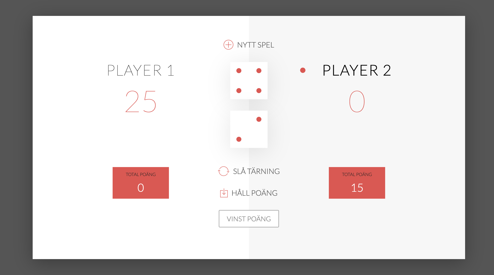

# 🐷 Workshop: Grisspelet

Er uppgift är att göra tärningsspelet Grisspelet interaktivt. HTML, CSS och bilder är färdiga. Ni skriver bara JavaScript i `js/app.js`, och där finns redan variabler, DOM-element och tomma funktioner att utgå från.



*Bilden visar spelet med extrautmaningarna gjorda — två tärningar och inputfältet för vinstpoäng. Grundspelet använder en tärning.*

Extra: Gör de tre extrautmaningarna längst ner i ticket-listan.

---

## 🎲 Spelregler

* Spelet har två spelare som turas om.
* Den aktiva spelaren klickar **Slå tärning** så många gånger hen vill. Varje kast läggs till i **Omgångspoäng**.
* Slår spelaren en **1:a** försvinner omgångspoängen och det blir den andra spelarens tur.
* Klickar spelaren **Håll poäng** flyttas omgångspoängen till totalpoängen (den stora röda siffran). Sedan är det den andra spelarens tur.
* Den som först når **100** i totalpoäng vinner. Då står det **Vinnare!** i stället för namnet, och det går inte att slå tärning eller hålla poäng. Bara **Nytt spel** fungerar.

---

## 🧠 Innan ni kodar

**Diskutera i teamet:**

* Vad är DOM:en, och hur hämtar man ett element med `querySelector`?
* Vad gör `addEventListener`? Vilken funktion körs när man klickar på respektive knapp?
* Hur får man fram ett heltal mellan 1 och 6 med `Math.random()`?
* Vad är skillnaden mellan `roundScore` och `scores`?
* Hur kan man använda `activePlayer` (0 eller 1) för att hitta rätt element, t.ex. `#current-0` eller `#current-1`?
* Varför behövs `isPlaying`?

**Rita ett flödesdiagram** på papper eller i Excalidraw: vad händer när man klickar *Slå tärning*, och vad händer när man klickar *Håll poäng*? Rita först, koda sen. Det är svårare att hitta fel i logiken när den bara finns i huvudet.

---

## 📁 Startfilen

I `js/app.js` finns speldatan och tomma funktioner. De element ni behöver hämtar ni själva under *Element i DOM:en*, och knapparna kopplar ni under *Händelser*. Klasser och id:n hittar ni i `index.html`.

**Två regler som gör det enklare:**

1. **Ändra datan först, visa den sedan.** Uppdatera t.ex. `roundScore` och skriv sedan ut den med `textContent`. Läs aldrig poängen från sidan.
2. **Testa ofta.** Lägg in en `console.log()` och kolla i DevTools innan ni går vidare.

---

## 🎫 Tickets

**SPEL-1 till SPEL-3** kan göras parallellt. **SPEL-4** bygger vidare på SPEL-3. **EXTRA** gör ni om ni hinner, när grundspelet är mergat till `main`.

### SPEL-1 · Nytt spel nollställer allt

Fyll i `init()`.

**Klart när:** alla fyra siffror visar 0, namnen är "Spelare 1" och "Spelare 2", Spelare 1 är aktiv, ingen panel har klassen `winner` och tärningen är dold. Det ska gälla både när sidan laddas och när man klickar **Nytt spel** mitt i en omgång.

### SPEL-2 · Slå tärning

Fyll i `rollDice()` och `switchPlayer()`.

**Klart när:** tärningen syns, bilden visar samma tal som slumpades, och talet läggs till i den aktiva spelarens omgångspoäng. Slår spelaren en 1:a nollställs omgångspoängen, den andra spelaren blir aktiv (grå bakgrund och röd prick flyttas över) och nästa kast räknas till rätt spelare.

### SPEL-3 · Håll poäng

Fyll i `holdScore()`, men vänta med vinstkontrollen. Bytet till nästa spelare görs med `switchPlayer()` från SPEL-2, så hämta `main` när den är mergad.

**Klart när:** omgångspoängen läggs till i totalpoängen, totalpoängen visas, och det blir den andra spelarens tur.

### SPEL-4 · Vinnare

Bygg ut `holdScore()` med en kontroll mot `WINNING_SCORE`.

**Klart när:** den som når 100 får texten **Vinnare!** och klassen `winner`, tärningen döljs, och varken **Slå tärning** eller **Håll poäng** gör något förrän man klickar **Nytt spel**.

*Tips:* Sätt `WINNING_SCORE` till 20 medan ni testar.

### EXTRA-1 · Två 6:or i rad

**Klart när:** en spelare som slår två 6:or direkt efter varandra förlorar hela sin totalpoäng, och det blir den andra spelarens tur.

*Tips:* Spara föregående kast i en ny variabel, t.ex. `let lastDice`.

### EXTRA-2 · Välj vinstpoäng

Inputfältet `.final-score` finns redan i HTML:en.

**Klart när:** spelet använder talet i fältet som vinstgräns, och 100 om fältet är tomt.

*Tips:* `.value` ger alltid en sträng. Hur gör man om den till ett tal?

### EXTRA-3 · Två tärningar

Den andra tärningen `#dice-2` finns redan i HTML:en.

**Klart när:** båda tärningarna slås och visas, summan läggs till i omgångspoängen, och omgången förloras om **någon** av dem är en 1:a.

---

## 🔗 Bra att veta

* [addEventListener (MDN)](https://developer.mozilla.org/en-US/docs/Web/API/EventTarget/addEventListener)
* [Math.random() (MDN)](https://developer.mozilla.org/en-US/docs/Web/JavaScript/Reference/Global_Objects/Math/random)
* [textContent (MDN)](https://developer.mozilla.org/en-US/docs/Web/API/Node/textContent)
* [classList (MDN)](https://developer.mozilla.org/en-US/docs/Web/API/Element/classList)
* [Template literals (MDN)](https://developer.mozilla.org/en-US/docs/Web/JavaScript/Reference/Template_literals)

---

## 🚀 Kom igång

### 1. En i gruppen skapar repot

1. Klicka **Use this template → Create a new repository** högst upp i det här repot.
2. Döp det till `workshop-pig-game-grupp-N` (byt ut N mot ert gruppnummer) och gör det **Public**.
3. **Settings → Collaborators → Add people.** Lägg till alla i gruppen.

### 2. Alla klonar gruppens repo

```bash
git clone <adressen till ert grupprepo>
cd workshop-pig-game-grupp-N
```

Öppna `index.html` med Live Server.

### 3. Fördela tickets

Ticketsen ligger i olika funktioner, så ni kan jobba parallellt. Ett förslag för fyra personer:

| Person | Ticket | Funktion |
|---|---|---|
| A | SPEL-1 | `init()` |
| B | SPEL-2 | `rollDice()` och `switchPlayer()` |
| C och D | SPEL-3, sedan SPEL-4 | `holdScore()`, i par |

Är ni färre, ta två var. Sitt gärna två och två på samma dator.

---

## 🔀 Så jobbar ni i Git tillsammans

**Ingen pushar direkt till `main`.** Allt går via en branch och en pull request som någon annan i gruppen granskar.

### För varje ticket

```bash
# 1. Utgå alltid från senaste main
git switch main
git pull

# 2. Skapa en branch för ticketen
git switch -c spel-2-sla-tarning

# 3. Koda, testa, committa. Skriv ticket-id först i meddelandet
git add .
git commit -m "SPEL-2: slumpar tärning och visar rätt bild"

# 4. Pusha branchen
git push -u origin spel-2-sla-tarning
```

### Öppna en pull request

1. Gå till ert repo på GitHub. Klicka **Compare & pull request** i den gula rutan.
2. Kontrollera att det står **base: `main`** och **compare: er branch**.
3. Fyll i PR-mallen och klicka **Create pull request**.
4. Lägg till en gruppkamrat under **Reviewers** och säg till i gruppen.

### Granska och merga

Den som granskar **hämtar hem branchen och testar** innan hen godkänner:

```bash
git fetch origin
git switch spel-2-sla-tarning
```

Hur ni granskar står i [REVIEW.md](REVIEW.md). När granskaren klickat **Approve** trycker hen på **Merge pull request**.

### När någon annans PR har mergats

```bash
git switch main
git pull
```

Jobbar du fortfarande på en egen branch, hämta in det nya:

```bash
git switch min-branch
git merge main
```

### Merge-konflikt?

Två har ändrat samma rader. Öppna filen i VS Code, välj vilken version som ska vara kvar (eller båda), ta bort markeringarna `<<<<<<<`, `=======` och `>>>>>>>`, och committa. Gör det tillsammans med den andra personen — det är ni två som vet vad koden ska göra.

---

Lycka till! 🤩

*// Sandra*
